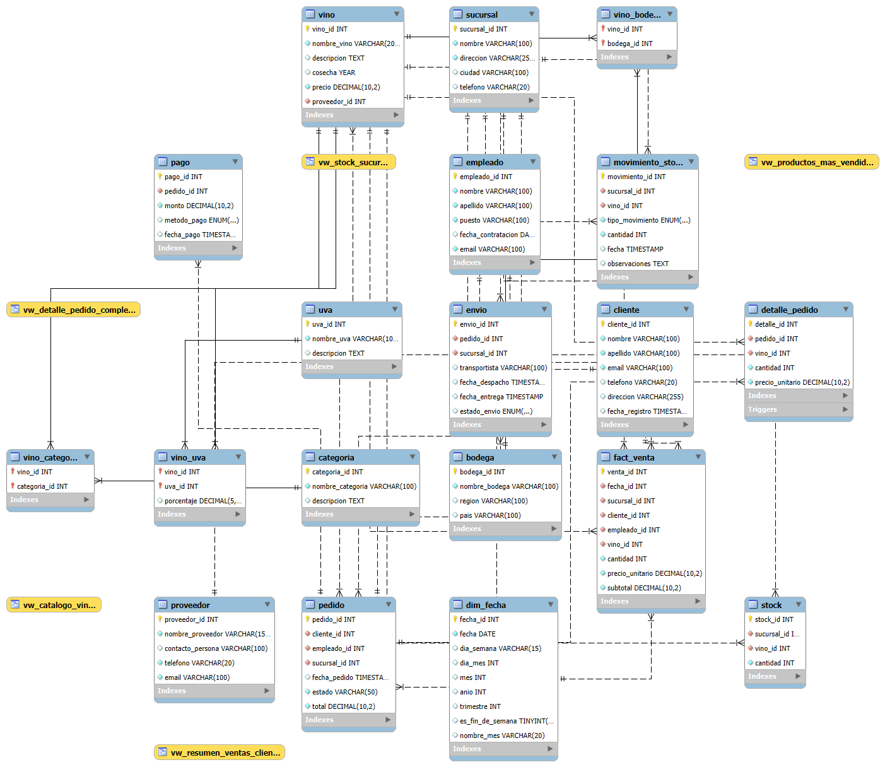

# Proyecto Final – Vinoteca *El Copihue*  
**Autor:** Alexei Sandoval  

---

## 1. Introducción  
Este proyecto es principalmente para el proyecto final de CoderHouse.

El objetivo principal es **centralizar y gestionar de manera eficiente toda la información clave del negocio**, desde el inventario de productos y el contacto con proveedores hasta el registro de clientes y el seguimiento de las ventas.  

La base de datos ha sido desarrollada para servir como el núcleo operativo del negocio, resolviendo los desafíos que surgen de la gestión manual de la información.  

---

## 2. Objetivo  
El propósito principal es desarrollar una **solución de base de datos robusta y escalable** que optimice las operaciones de la vinoteca.  

### Objetivos específicos:  
- **Optimizar el control de inventario:** Mantener un registro preciso y en tiempo real del stock de vinos.  
- **Mejorar la gestión de la información:** Centralizar datos de clientes y proveedores en un sistema seguro.  
- **Facilitar el análisis de negocio:** Generar reportes detallados para la toma de decisiones estratégicas.  
- **Sentar las bases para la expansión:** Integrar futuras aplicaciones como un e-commerce o sistema de punto de venta.  

---

## 3. Situación Problemática  
Actualmente, la vinoteca gestiona sus registros de forma manual con planillas y documentos de texto.  

**Problemas principales:**  
- Inconsistencias en los datos.  
- Falta de control de stock en tiempo real.  
- Dificultad para realizar análisis de negocio.  

La implementación de esta base de datos **resuelve estas limitaciones** con un sistema automatizado, seguro y eficiente.  

---

## 4. Modelo de Negocio  
La vinoteca opera bajo un modelo de **venta al por menor (retail)**.  

**Cadena de valor:**  
1. **Abastecimiento:** Compra de vinos a distintas viñas/proveedores.  
2. **Catálogo:** Clasificación por categoría, uva y bodega.  
3. **Venta:** Registro de pedidos y generación de transacciones.  
4. **Gestión de pedidos:** Actualización automática del stock y seguimiento de entregas.  

---

## 5. Diagrama E-R  
El siguiente **diagrama de entidad-relación (E-R)** representa la estructura lógica de la base de datos, mostrando entidades principales y relaciones entre ellas.  

Clientes, empleados y sucursales:
Los clientes son quienes realizan pedidos. Cada pedido es gestionado por un empleado y está asociado a una sucursal específica.

Pedidos y detalles:
Un pedido puede contener varios productos (vinos). Esto se refleja en la relación con la tabla detalle_pedido, que especifica el vino comprado, la cantidad y el precio unitario.

Vinos, proveedores y categorías:
Cada vino es suministrado por un proveedor y se clasifica en una o varias categorías (ejemplo: tinto, blanco, espumante). Además, puede estar asociado a una o varias uvas y a una bodega, lo que permite un catálogo detallado.

Stock y sucursales:
El stock se gestiona de manera independiente en cada sucursal mediante la tabla stock, que relaciona un vino con la sucursal donde está disponible.

Pagos y envíos:
Cada pedido puede tener uno o más pagos (ejemplo: tarjeta, efectivo, transferencia) y se vincula también a un envío, el cual contiene la información de despacho, transportista y estado de la entrega.

Movimientos de stock:
La tabla movimiento_stock registra entradas y salidas de vinos en cada sucursal, permitiendo llevar un historial detallado de inventario.

Análisis de ventas (fact_venta y dim_fecha):
Para fines analíticos, la base incluye una tabla de hechos (fact_venta) vinculada con una dimensión de tiempo (dim_fecha). Esto permite generar reportes de ventas por día, mes, trimestre o año.

---

## 6. Listado de Tablas  

### Tabla: `cliente`  
| Abreviatura  | Nombre Completo      | Tipo de Dato     | Clave     |  
|--------------|----------------------|------------------|-----------|  
| cliente_id   | ID del Cliente       | INT AUTO_INCREMENT | PK        |  
| nombre       | Nombre del Cliente   | VARCHAR(100)     |           |  
| apellido     | Apellido del Cliente | VARCHAR(100)     |           |  
| email        | Email del Cliente    | VARCHAR(100)     | UNIQUE    |  
| telefono     | Teléfono             | VARCHAR(20)      |           |  
| direccion    | Dirección            | VARCHAR(255)     |           |  
| fecha_registro | Fecha de Registro  | TIMESTAMP        |           |  

---

### Tabla: `proveedor`  
| Abreviatura     | Nombre Completo    | Tipo de Dato     | Clave  |  
|-----------------|--------------------|------------------|--------|  
| proveedor_id    | ID del Proveedor   | INT AUTO_INCREMENT | PK   |  
| nombre_proveedor| Nombre del Proveedor | VARCHAR(150)   |        |  
| contacto_persona| Persona de Contacto | VARCHAR(100)   |        |  
| telefono        | Teléfono           | VARCHAR(20)     |        |  
| email           | Email              | VARCHAR(100)    | UNIQUE |  

---

### Tabla: `categoria`  
| Abreviatura   | Nombre Completo     | Tipo de Dato     | Clave  |  
|---------------|---------------------|------------------|--------|  
| categoria_id  | ID de la Categoría  | INT AUTO_INCREMENT | PK   |  
| nombre_categoria | Nombre de la Categoría | VARCHAR(100) | UNIQUE |  
| descripcion   | Descripción         | TEXT             |        |  

---

### Tabla: `vino`  
| Abreviatura  | Nombre Completo   | Tipo de Dato     | Clave  |  
|--------------|-------------------|------------------|--------|  
| vino_id      | ID del Vino       | INT AUTO_INCREMENT | PK   |  
| nombre_vino  | Nombre del Vino   | VARCHAR(200)     | INDEX |  
| descripcion  | Descripción       | TEXT             |        |  
| cosecha      | Año de Cosecha    | YEAR             |        |  
| precio       | Precio Unitario   | DECIMAL(10, 2)   |        |  
| proveedor_id | ID del Proveedor  | INT              | FK     |  

---

### Tabla: `pedido`  
| Abreviatura   | Nombre Completo     | Tipo de Dato     | Clave  |  
|---------------|---------------------|------------------|--------|  
| pedido_id     | ID del Pedido       | INT AUTO_INCREMENT | PK   |  
| cliente_id    | ID del Cliente      | INT              | FK     |  
| empleado_id   | ID del Empleado     | INT              | FK     |  
| sucursal_id   | ID de la Sucursal   | INT              | FK     |  
| fecha_pedido  | Fecha del Pedido    | TIMESTAMP        | INDEX |  
| total         | Total del Pedido    | DECIMAL(10, 2)   |        |  
| estado        | Estado del Pedido   | VARCHAR(50)      |        |  

---

### Tabla: `detalle_pedido`  
| Abreviatura  | Nombre Completo     | Tipo de Dato     | Clave  |  
|--------------|---------------------|------------------|--------|  
| detalle_id   | ID del Detalle      | INT AUTO_INCREMENT | PK   |  
| pedido_id    | ID del Pedido       | INT              | FK     |  
| vino_id      | ID del Vino         | INT              | FK     |  
| cantidad     | Cantidad            | INT              |        |  
| precio_unitario | Precio Unitario  | DECIMAL(10, 2)   |        |  

---

## 7. Scripts de Creación, Inserción y Consultas  

- **`EntregaFinal.sql`**  
  Crea el esquema de la base de datos y define las tablas. Establece integridad referencial.  

- **`vistasydatos.sql`**  
  Implementa la lógica de negocio con vistas, funciones, procedimientos y triggers. Inserta datos iniciales.  

- **`ConsultasFinal.sql`**  
  Incluye consultas analíticas para extraer información útil (ventas, clientes frecuentes, stock bajo, etc.).  

---

## 8. Herramientas y Tecnologías Utilizadas  
- **MySQL/MariaDB** – Sistema de gestión de bases de datos.  
- **SQL** – Lenguaje estándar para manipulación de datos.  
- **MySQL Workbench** – Diseño visual y ejecución de scripts.  
- **Git y GitHub** – Control de versiones y almacenamiento del proyecto.  

---

## 9. Conclusión  
La implementación de esta base de datos relacional para **"Vinoteca El Copihue"** representa una mejora significativa en la gestión del negocio.  

- Centraliza la información clave.  
- Optimiza el control de inventario.  
- Automatiza la gestión de pedidos.  
- Facilita la generación de reportes y análisis de ventas.  

Esto proporciona a la vinoteca una **plataforma sólida para crecer**, mejorar su competitividad y prepararse para futuras integraciones tecnológicas.  

---

## 📂 Archivos del Proyecto  
- `EntregaFinal.sql`  
- `vistasydatos.sql`  
- `ConsultasFinal.sql`  

---

## 📌 Orden de Instalación  
1. **`EntregaFinal.sql`** → crea la base de datos y las tablas.  
2. **`vistasydatos.sql`** → carga vistas, procedimientos, triggers y datos iniciales.  
3. **`ConsultasFinal.sql`** → ejecuta consultas analíticas y reportes finales.  

---

## ✅ Recomendaciones Técnicas  
- Ejecutar en un entorno **MySQL/MariaDB**.  
- Verificar que no exista previamente una base con el nombre `vinoteca_el_copihue`.  
- Correr cada script de forma **secuencial**, validando que no existan errores.  
